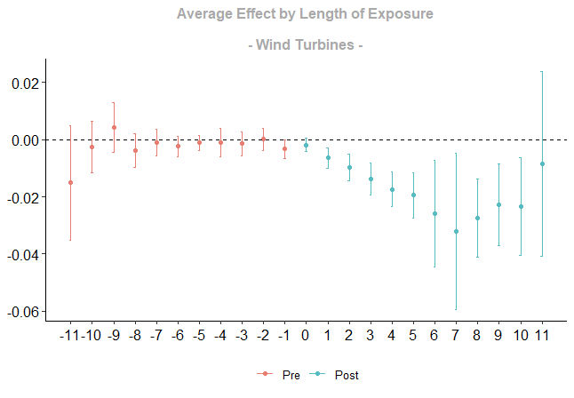

# Gone With the Wind: Renewable Energy Projects and Population Change

This repository is for a paper in progress on how renewable energy projects affect population dynamics.

The figure below is evidence that windmills cause population decline by approximately 2%.

