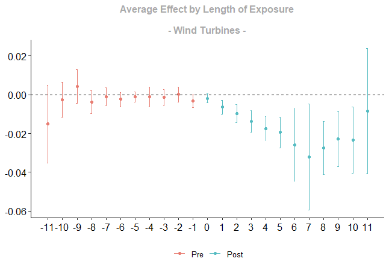

# Gone With the Wind: Renewable Energy Projects and Population Change

This repository is for a paper how renewable energy projects affect population dynamics that is currently a R&R at *Energy Economics*.

The figure below is evidence that windmills cause population decline by approximately 2-3%.

